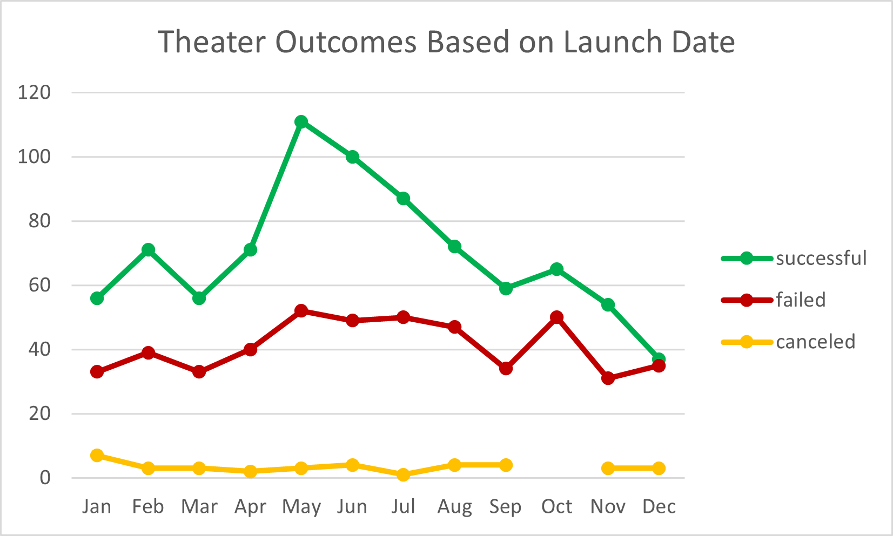
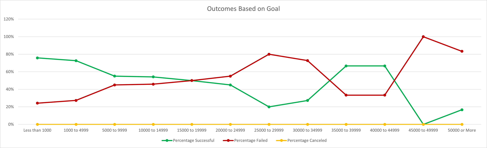

# Kickstarting with Excel

## Overview of Project

### Purpose

To visualize campaign outcomes in relation to their launch dates and their funding goals. 

Using data from Louise's Kickstarter campaigns we analyzed how successful/unsuccessful her theater campaigns were in relation to their launch dates, and how the funding goals affected the plays campaigns' outcomes. 

## Analysis and Challenges

### Analysis of Outcomes Based on Launch Date

We can see that throughout the year, the number of failed campaigns remains relatively constant, there arent very many spikes. However within the winter months we tend to see not as many failed campaigns. 

There is, however, a drastic spike of successful campaigns within the summer months indicating that this is the best time to launch new campaigns. 

### Analysis of Outcomes Based on Goals

We can see that there is a higher percentage of successful campaigns with lower goal amounts with a few exceptions, these should be investigated further to find out what other factors may be influencing the campaign's success.

### Challenges and Difficulties Encountered

The more challenging part of putting this data analysis together was learning and understanding GitHub. It is a new software I never worked before and I needed support understanding the terminology used for certain things, like what a branch was. Also, getting help with cleaning up and deleting files I did not need and lastly uploading folders.

## Results

* The best month to launch a campaign with a successful outcome is May.
* Louise should avoid launching new campaigns in January and December.
* The more successful play campaigns are those with a goal of $1,000 or less.

<ins>Limitations of the dataset</ins>: We don't know how the data was collected; the sample size may not be sufficient or there may be biases that are not being considered.

<ins>Other Possible Tables/Graphs</ins>: A graph could be made taking the pledged amount, country and subcategory date to see in which countries certain campaigns have been doing better, which countries have the higher amounts pledged and which campaigns have the higher amounts pledged as well.
